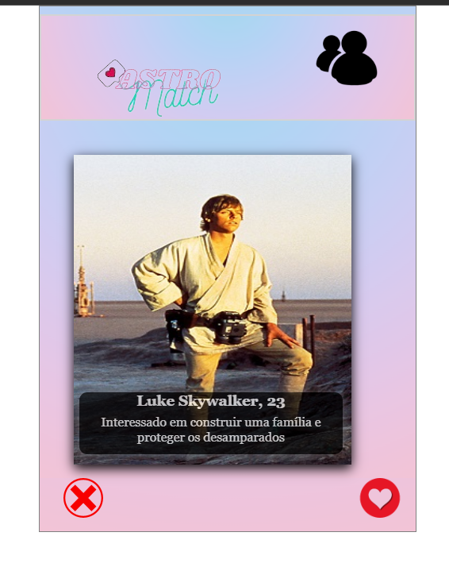
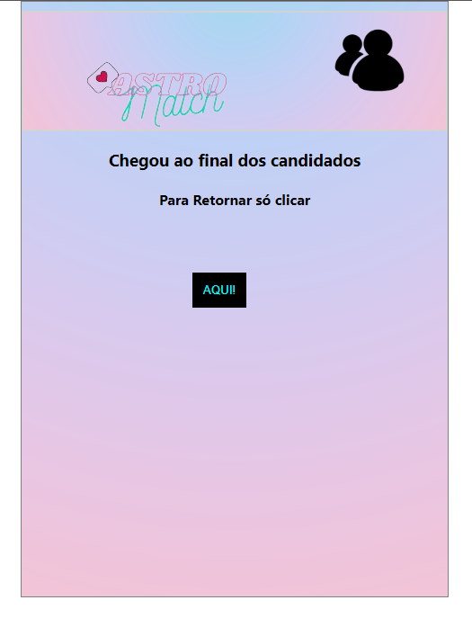
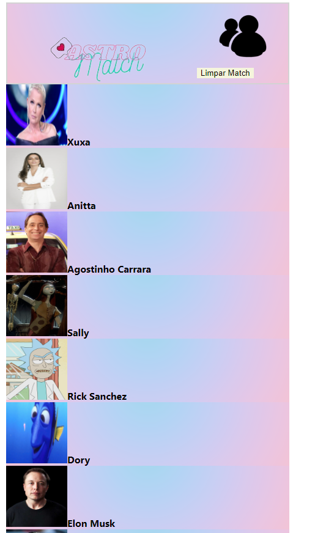

<h1>Projeto AstroMatch</h1>

*Link Surge*
http://erratic-vegetable.surge.sh/

##### Tecnologias utilizadas

[x]React
[x]Javascript
[x]HTML
[x]Styled Components
[x]Hooks
[X]API (Disponibilizada pela instituição Labenu)

Sendo uma versão clone de aplicativo para relacionamento

Um pequeno passo para a humanidade um grande passo para mim.

# Página inicial

Botões com funcionalidade ao clicar no coração possiveis condidados serão adicionais a página de matchs

#### Página inicial quando chega ao fim da api

 Com funcionalidade ao botão para retornar ao inicio da API

# Página Matchs

Página que recebe matchs dados na página inicial

#### Página Matchs após limpar candidados
